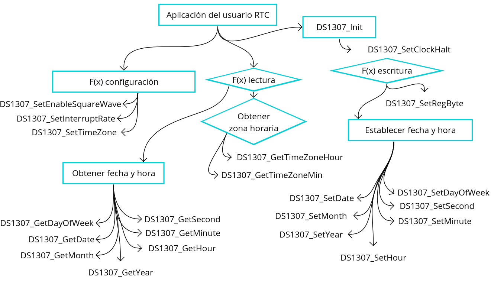

# API de RTC DS1307 para STM32 HAL

Esta es una biblioteca de software escrita en C para interactuar con el reloj en tiempo real DS1307 utilizando la interfaz I2C en un microcontrolador STM32 con el framework HAL (Hardware Abstraction Layer).

## Funciones principales

### Inicialización

- `DS1307_Init(I2C_HandleTypeDef *hi2c)`: Inicializa el módulo DS1307 configurando la comunicación I2C y activando el reloj si está detenido.

### Configuración

- `DS1307_SetClockHalt(uint8_t halt)`: Establece el estado de parada del reloj del DS1307.
- `DS1307_SetEnableSquareWave(DS1307_SquareWaveEnable mode)`: Habilita o deshabilita la salida de onda cuadrada del DS1307.
- `DS1307_SetInterruptRate(DS1307_Rate rate)`: Establece la frecuencia de la onda cuadrada de salida del DS1307.
- `DS1307_SetTimeZone(int8_t hr, uint8_t min)`: Establece la zona horaria UTC en el DS1307.

### Lectura

- `DS1307_GetClockHalt()`: Obtiene el estado actual del bit de parada del reloj del DS1307.
- `DS1307_GetDayOfWeek()`: Obtiene el día actual de la semana del DS1307.
- `DS1307_GetDate()`: Obtiene el día del mes actual del DS1307.
- `DS1307_GetMonth()`: Obtiene el mes actual del DS1307.
- `DS1307_GetYear()`: Obtiene el año actual del DS1307.
- `DS1307_GetHour()`: Obtiene la hora actual en formato de 24 horas del DS1307.
- `DS1307_GetMinute()`: Obtiene los minutos actuales del DS1307.
- `DS1307_GetSecond()`: Obtiene los segundos actuales del DS1307.
- `DS1307_GetTimeZoneHour()`: Obtiene la hora de la zona horaria UTC almacenada en el DS1307.
- `DS1307_GetTimeZoneMin()`: Obtiene los minutos de la zona horaria UTC almacenada en el DS1307.

### Escritura

- `DS1307_SetRegByte(uint8_t regAddr, uint8_t val)`: Escribe un byte en un registro específico del DS1307.
- `DS1307_SetDayOfWeek(uint8_t dow)`: Establece el día de la semana en el DS1307.
- `DS1307_SetDate(uint8_t date)`: Establece el día del mes en el DS1307.
- `DS1307_SetMonth(uint8_t month)`: Establece el mes en el DS1307.
- `DS1307_SetYear(uint16_t year)`: Establece el año en el DS1307.
- `DS1307_SetHour(uint8_t hour_24mode)`: Establece la hora en el DS1307.
- `DS1307_SetMinute(uint8_t minute)`: Establece los minutos en el DS1307.
- `DS1307_SetSecond(uint8_t second)`: Establece los segundos en el DS1307.

## Utilización

1. Inicializa la comunicación I2C con el DS1307 llamando a `DS1307_Init()`.
2. Utiliza las funciones de configuración para ajustar los parámetros del DS1307 según tus necesidades.
3. Emplea las funciones de lectura para obtener la fecha, hora y zona horaria actuales del DS1307.
4. Utiliza las funciones de escritura para establecer la fecha, hora y otros parámetros en el DS1307.

Para más detalles sobre cada función y sus parámetros, consulta el archivo de encabezado `rtc_ds1307_for_stm32_hal.h`.

## Esquema 

## Licencia

Esta biblioteca se distribuye bajo la Licencia Pública General de GNU v3.0. Consulta el archivo de licencia para obtener más información sobre los términos y condiciones de uso.

### Estructura del Repositorio

El repositorio está organizado de la siguiente manera:

    |APIs/
    │
    ├── Inc/ - Código fuente de la API.
    │ └── rtc_ds1307_for_stm32_hal.h
    │
    ├── Src/ - Código fuente de la API.
    │ └── rtc_ds1307_for_stm32_hal.c
    │
    ├── test/ - Pruebas unitarias.
    │ └── test_rtc_ds1307_for_stm32_hal.c
    │
    └── README.md - Este archivo.
